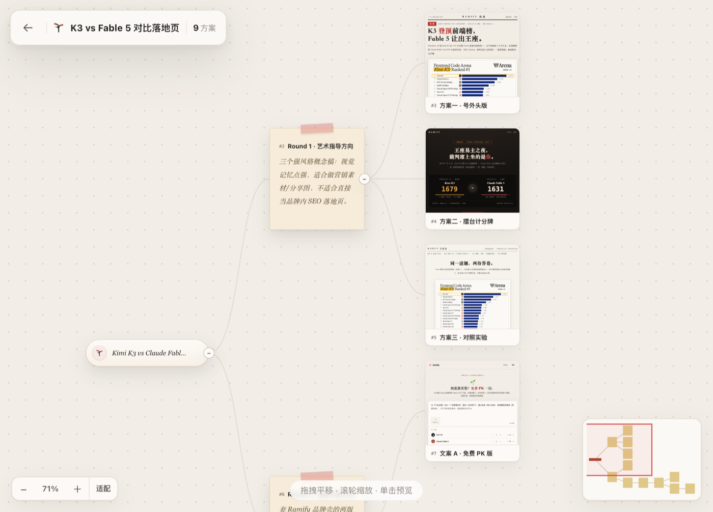

<p align="center">
  
</p>

<h1 align="center">dsh-ramify</h1>

<p align="center">
  <strong>DeepSeek Harness 的原生创意分支画布插件</strong>
</p>

<p align="center">
  
  
  
</p>

Ramify 是一个专为 DeepSeek Harness（DSH）开发的 `dsh-plugin`。它把 Agent 生成的多个创作方向、可运行作品和后续修订组织成一棵实时更新的创意树，让你可以在 DSH 内直接查看、比较并继续分叉。



## 工作方式

1. 点击 DSH 左侧栏的 **Ramify**，打开内置工作台。
2. 在 Ramify 原生输入框中输入需求并选择方案数量。
3. 插件立即创建项目并进入画布，同时把任务提交给当前 DSH 会话和模型。
4. Agent 通过 Ramify 工具把方案持续写入画布，节点和预览实时出现。
5. 点击节点右上角的发散按钮，输入修改要求，即可从该节点继续生成分支。

整个过程不需要复制本地地址，也不需要在 Ramify 中再次配置模型或 API Key。

## 特性

- **原生 DSH 插件**：使用标准插件清单、Cordis 服务和 Client UI 插槽，没有修改 Harness 源码。
- **原生 Ramify UI**：保留网站版创作票据、数量选择、画布、节点卡片和分支气泡的视觉与交互。
- **当前会话驱动**：界面提交通过 DSH 官方会话输入能力发送给当前模型。
- **即时进入画布**：首页提交后先创建项目并立即打开画布，Agent 随后向同一项目写入节点。
- **可视化分支**：从任意已完成节点继续发散，旧方案保持不变。
- 安装后自动启动本地画布，不需要单独运行 CLI。
- HTML、Markdown、SVG、图片、视频和音频作品可直接预览。
- SQLite 本地持久化，前端轻量轮询感知变更。
- 不接收或存储模型 API Key。
- 插件卸载时清理自己启动的运行时；已有 Ramify 实例会被复用而不会被关闭。

## 环境要求

- Node.js 22.19 或更高版本
- DeepSeek Harness 0.1.0-rc.6（当前测试版本）或兼容版本

## 安装

### 从源码安装（当前推荐）

```sh
git clone https://github.com/yanglongyun/dsh-ramify.git
cd dsh-ramify
npm install
npm run build

dsh plugin --profile web add "$PWD"
dsh web --port 3099
```

### npm 包发布后

```sh
dsh plugin --profile web add @ramify/dsh-ramify
dsh web --port 3099
```

启动后点击 DSH 左侧栏底部的 **Ramify**。插件会自动启动运行时，并把工作台嵌入 DSH 覆层；顶部的外部打开按钮仅作为可选的独立窗口模式。

## 使用

你可以直接从 Ramify 输入框开始，也可以在 DSH 对话中要求 Agent 使用 Ramify。例如：

> 使用 Ramify 为这个 AI 搜索产品探索三个明显不同的落地页方向，做出可预览页面让我比较。

插件向模型注册以下工具：

| 工具 | 用途 |
|---|---|
| `ramify_start` | 启动或连接画布 |
| `ramify_project_create` | 创建项目与根节点 |
| `ramify_project_list` | 列出项目 |
| `ramify_project_tree` | 读取完整创意树 |
| `ramify_node_add` | 添加单个节点或作品占位符 |
| `ramify_node_batch` | 原子化创建多层节点树 |
| `ramify_node_complete` | 写入 HTML、Markdown、SVG 或媒体作品 |
| `ramify_node_update` | 更新标题、文本或树位置 |
| `ramify_settings` | 切换主题和界面语言 |

## 架构

```text
Ramify UI (DSH overlay iframe)
        │ 结构化创建/分支意图
        ▼
DSH Client UI 会话桥 ──► 当前 DSH 会话与模型
        │                         │
        │ 轻量轮询感知变更        │ Ramify tools
        ▼                         ▼
本地 Ramify runtime ◄──── 项目、节点与作品
        │
        └── SQLite + 本地 artifact 文件
```

- DSH Web UI：默认 `http://127.0.0.1:3099`
- Ramify runtime：默认 `http://127.0.0.1:9519`
- DSH Web UI 与 Ramify runtime 通过 HTTP 连接；作品详情按普通网页完整运行。

## 配置

用户可以在 profile 的 `cordis.patch.yml` 中覆盖插件配置：

```yaml
- id: ramify
  name: '@ramify/dsh-ramify'
  config:
    port: 9519
    dataDir: '/absolute/path/to/ramify-data'
    startupTimeoutMs: 5000
    shutdownTimeoutMs: 3000
```

`dataDir` 省略时使用平台默认目录：

- macOS：`~/Library/Application Support/Ramify/`
- Windows：`%APPDATA%/Ramify/`
- Linux：`${XDG_DATA_HOME:-~/.local/share}/ramify/`

## 开发

```sh
npm install
npm run typecheck
npm test
npm run build
npm pack --dry-run
```

一条命令执行完整检查：

```sh
npm run check
```

检查内容包括 TypeScript、插件测试、Ramify runtime/UI 测试、生产构建和 npm 包内容验证。

构建产物 `lib/` 与 `app/dist/` 会提交到仓库，因此从本地 checkout 或 Git 安装时不需要执行安装期构建脚本。

浏览器端通过包清单中的 `dsh.client` 声明加载，使用 DSH 提供的侧栏、覆层、工具卡和会话输入插槽，并复用 Harness 提供的 React 运行时。npm 关键字和 GitHub Topic 均包含 **`dsh-plugin`**。

## 数据与作品运行

- 默认数据保存在操作系统应用数据目录，升级或重启不会清空。
- 插件不读取、不接收也不保存模型 API Key；模型调用由当前 DSH 会话负责。
- Runtime 监听 `0.0.0.0:9519`，DSH 默认通过 `127.0.0.1:9519` 访问并管理它。
- 画布卡片缩略图使用空 `sandbox`，不会运行 JavaScript，避免大量作品同时执行脚本拖慢画布。
- 右侧详情与新窗口作品不使用 sandbox 或 CSP，可正常运行脚本、加载外部资源、联网和提交表单。

## 许可证

[MIT](LICENSE)。第三方依赖许可见 [THIRD_PARTY_NOTICES.md](THIRD_PARTY_NOTICES.md)。
